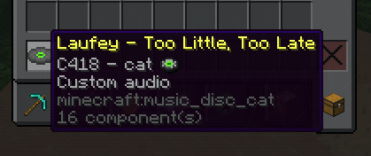
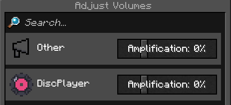

**⚠️ THIS PROJECT WAS MADE WITH THE HELP OF AI (CLAUDE, BY ANTHROPIC). ⚠️**

# 💿 DiscPlayer

A small **Paper** plugin that lets you put your **own audio** on **music discs**. Put the disc in a jukebox and everyone nearby hears your song through [Simple Voice Chat](https://modrinth.com/plugin/simple-voice-chat).

Inspired by the [Audio Player](https://github.com/henkelmax/audio-player) mod by henkelmax. DiscPlayer is a much smaller plugin written from scratch for Paper, with only the music disc part.

## ✨ Features

- Upload `.mp3` or `.wav` files from a direct link (operators only)
- Give each song a name, and the music disc takes that name
- Any player can apply a song to their own disc
- Tab-complete suggestions for commands and song names
- The normal disc sound is muted, and your audio plays from the jukebox instead
- Shows `Now Playing: <song name>` above the hotbar
- Audio stops when the disc is taken out or the jukebox is broken
- Adds a **DiscPlayer** slider in Simple Voice Chat's *Adjust Volumes* menu, so players can turn disc audio up or down

## 📸 Screenshots

| Commands | Custom Disc |
| :---: | :---: |
|  |  |
| **Now Playing Text** | **Voice Chat Menu** |
|  |  |

## 📋 Requirements

- A **Paper 26.3** server
- **Simple Voice Chat** installed on the server, and players need Simple Voice Chat on their client to hear the audio
- Java 25 or newer to run the server

Tested on Paper 26.3 (build 159, beta) with Simple Voice Chat 2.6.24.

## 🔧 Installing

There is no download page yet, so build it yourself:

1. Install a **JDK 26** and clone this repo
2. Run this in the project folder:
   ```
   ./gradlew build
   ```
3. Take `build/libs/DiscPlayer-1.0-SNAPSHOT-all.jar` and put it in your server's `plugins` folder. Use the `-all` file, because it has the mp3 reader built in. Delete any older DiscPlayer jar first.
4. Restart the server

## 🎮 How to use

**1. An operator uploads a song**

```
/discplayer upload <link> [name]
```

- The link must go straight to an `.mp3` or `.wav` file (max 20 MB)
- If you leave out the name, it uses the file name from the link, or `(no name)` if there isn't one
- Songs are saved in `plugins/DiscPlayer/audio/`

**2. A player puts the song on a disc**

Hold a music disc and run:

```
/discplayer apply <song name>
```

Press Tab to see the available songs. Spaces in names show up as underscores in the suggestions.

**3. Play it**

Right-click a jukebox with the disc. To stop it, take the disc out or break the jukebox.

## 🔐 Who can do what

| Command | Who |
| --- | --- |
| `/discplayer upload <link> [name]` | Operators only |
| `/discplayer apply <song name>` | Any player |

Uploads are limited to operators because the server downloads whatever link it is given.

## ⚠️ Limitations

- Only direct links to `.mp3` and `.wav` files work. Streaming sites such as Spotify, Apple Music or YouTube are not supported.
- Only discs put in by right-clicking a jukebox are handled
- Only upload audio you have the right to use

## 🙏 Credits

- [Simple Voice Chat](https://modrinth.com/plugin/simple-voice-chat) by henkelmax
- [Audio Player](https://github.com/henkelmax/audio-player) by henkelmax, which inspired this plugin
- [Paper](https://papermc.io/)
- MP3 reading by the MP3SPI and JLayer libraries

Made by [DJJoe6895](https://github.com/DJJoe6895), with help from AI.
